# CJP Southern Star OPC Database ERD

This document describes the current approved Laravel database design for the CJP Southern Star OPC inventory and sales system. It is based on the existing migrations in `database/migrations` and does not propose new tables or silently redesign the schema.

## 1. ERD Overview

The schema separates physical fuel movement from financial transactions:

- `purchases` and `purchase_items` record procurement from depots.
- `hauls` record fuel lifting/transport activity from a depot for a purchased fuel item.
- `haul_allocations` split a haul into one or more destinations: garage inventory or direct customer allocation.
- `inventory_movements` record garage stock in/out ledger entries.
- `stock_outs` record fuel released from garage inventory for a customer sale/delivery.
- `deliveries` record dispatch to customers from either garage or depot.
- `sales`, `sale_items`, `payment_schedules`, `payments`, and `receivables` record the financial customer flow.
- `alerts`, `report_runs`, and `ai_insights` support operational monitoring and reporting.

Supported operational flows:

1. Depot -> Purchase -> Haul -> Garage Allocation -> Inventory Movement -> Stock Out -> Delivery -> Customer
2. Depot -> Purchase -> Haul -> Direct Customer Allocation -> Delivery -> Customer
3. Customer -> Sale -> Payment(s) -> Receivable status/remaining balance

Split hauls are supported by multiple `haul_allocations` rows for one `haul_id`; no percentage split is hardcoded.

## 2. Mermaid ER Diagram

```mermaid
erDiagram
    USERS ||--o| DRIVER_PROFILES : has
    USERS ||--o{ PURCHASES : creates
    USERS ||--o{ SALES : creates
    USERS ||--o{ PAYMENTS : receives
    USERS ||--o{ HAULS : drives
    USERS ||--o{ DELIVERIES : drives
    USERS ||--o{ STOCK_OUTS : creates
    USERS ||--o{ INVENTORY_MOVEMENTS : creates
    USERS ||--o{ ALERTS : assigned
    USERS ||--o{ REPORT_RUNS : generates
    USERS ||--o{ AI_INSIGHTS : generates

    DEPOTS ||--o{ PURCHASES : supplies
    DEPOTS ||--o{ HAULS : source
    DEPOTS ||--o{ DELIVERIES : source

    FUEL_TYPES ||--o{ PURCHASE_ITEMS : purchased_as
    FUEL_TYPES ||--o{ HAULS : hauled_as
    FUEL_TYPES ||--o{ HAUL_ALLOCATIONS : allocated_as
    FUEL_TYPES ||--o{ SALE_ITEMS : sold_as
    FUEL_TYPES ||--o{ DELIVERIES : delivered_as
    FUEL_TYPES ||--o{ STOCK_OUTS : released_as
    FUEL_TYPES ||--o{ INVENTORY_MOVEMENTS : moved_as

    STORAGE_LOCATIONS ||--o{ HAUL_ALLOCATIONS : receives
    STORAGE_LOCATIONS ||--o{ DELIVERIES : source
    STORAGE_LOCATIONS ||--o{ STOCK_OUTS : releases
    STORAGE_LOCATIONS ||--o{ INVENTORY_MOVEMENTS : records

    CUSTOMERS ||--o{ SALES : places
    CUSTOMERS ||--o{ HAUL_ALLOCATIONS : receives_direct
    CUSTOMERS ||--o{ DELIVERIES : receives
    CUSTOMERS ||--o{ STOCK_OUTS : receives

    TRUCKS ||--o{ HAULS : hauls
    TRUCKS ||--o{ DELIVERIES : dispatches

    PURCHASES ||--o{ PURCHASE_ITEMS : contains
    PURCHASES ||--o{ HAULS : generates
    PURCHASE_ITEMS ||--o{ HAULS : lifted_by

    HAULS ||--o{ HAUL_ALLOCATIONS : contains
    HAUL_ALLOCATIONS ||--o{ DELIVERIES : fulfilled_by

    SALES ||--o{ SALE_ITEMS : contains
    SALES ||--o{ PAYMENT_SCHEDULES : schedules
    SALES ||--o{ PAYMENTS : receives
    SALES ||--o| RECEIVABLES : tracks
    SALES ||--o{ HAUL_ALLOCATIONS : may_allocate_direct
    SALES ||--o{ DELIVERIES : fulfilled_by
    SALES ||--o{ STOCK_OUTS : releases

    SALE_ITEMS ||--o{ DELIVERIES : fulfilled_by
    SALE_ITEMS ||--o{ STOCK_OUTS : releases

    PAYMENT_SCHEDULES ||--o{ PAYMENTS : receives
    DELIVERIES ||--o{ STOCK_OUTS : may_link
    INVENTORY_MOVEMENTS ||--o{ STOCK_OUTS : may_back

    REPORT_RUNS ||--o{ AI_INSIGHTS : produces

    USERS {
        bigint id PK
        string name
        string email UK
        enum role
        string phone "nullable"
        enum status
        timestamp last_login_at "nullable"
    }

    DEPOTS {
        bigint id PK
        string depot_code UK
        string name
        string address "nullable"
        string contact_person "nullable"
        string phone "nullable"
        enum status
    }

    FUEL_TYPES {
        bigint id PK
        string code UK
        string name UK
        text description "nullable"
        enum status
    }

    STORAGE_LOCATIONS {
        bigint id PK
        string location_code UK
        string name
        enum type
        string address "nullable"
        enum status
    }

    CUSTOMERS {
        bigint id PK
        string customer_code UK
        string name
        string company_name
        string location "nullable"
        string email "nullable"
        string phone "nullable"
        enum payment_status
        enum status
    }

    TRUCKS {
        bigint id PK
        string truck_code UK
        string plate_number UK "nullable"
        decimal capacity_liters
        enum truck_type
        enum status
    }

    DRIVER_PROFILES {
        bigint id PK
        bigint user_id FK "unique"
        string driver_code UK
        string license_number "nullable"
        string emergency_contact "nullable"
        enum status
    }

    PURCHASES {
        bigint id PK
        string purchase_code UK
        bigint depot_id FK
        date purchase_date
        string receipt_reference "nullable"
        enum payment_status
        enum status
        bigint created_by FK "nullable"
        timestamp deleted_at "nullable"
    }

    PURCHASE_ITEMS {
        bigint id PK
        bigint purchase_id FK
        bigint fuel_type_id FK
        decimal quantity_ordered_liters
        decimal unit_cost
        decimal line_total
        decimal quantity_hauled_liters
        enum status
    }

    HAULS {
        bigint id PK
        string haul_code UK
        bigint purchase_id FK
        bigint purchase_item_id FK
        bigint depot_id FK
        bigint fuel_type_id FK
        bigint truck_id FK
        bigint driver_user_id FK
        string dr_number "nullable"
        datetime scheduled_at
        datetime hauled_at "nullable"
        string source_location "nullable"
        decimal quantity_liters
        enum status
    }

    HAUL_ALLOCATIONS {
        bigint id PK
        bigint haul_id FK
        bigint fuel_type_id FK
        enum destination_type
        bigint storage_location_id FK "nullable"
        bigint customer_id FK "nullable"
        bigint sale_id FK "nullable"
        decimal quantity_liters
        datetime allocated_at "nullable"
        enum status
    }

    SALES {
        bigint id PK
        string sale_code UK
        bigint customer_id FK
        date sale_date
        enum payment_method "nullable"
        enum payment_terms
        enum status
        bigint created_by FK "nullable"
        timestamp deleted_at "nullable"
    }

    SALE_ITEMS {
        bigint id PK
        bigint sale_id FK
        bigint fuel_type_id FK
        decimal quantity_liters
        decimal unit_price
        decimal line_total
        decimal fulfilled_quantity_liters
    }

    PAYMENT_SCHEDULES {
        bigint id PK
        bigint sale_id FK
        date due_date
        decimal amount_due
        enum status
    }

    PAYMENTS {
        bigint id PK
        string payment_code UK
        bigint sale_id FK
        bigint payment_schedule_id FK "nullable"
        date payment_date
        decimal amount
        enum method
        string reference_number "nullable"
        bigint received_by FK "nullable"
    }

    RECEIVABLES {
        bigint id PK
        bigint sale_id FK "unique"
        date due_date "nullable"
        enum status
        datetime last_follow_up_at "nullable"
        text notes "nullable"
    }

    DELIVERIES {
        bigint id PK
        string delivery_code UK
        bigint sale_id FK "nullable"
        bigint sale_item_id FK "nullable"
        bigint customer_id FK
        bigint fuel_type_id FK
        enum source_type
        bigint depot_id FK "nullable"
        bigint storage_location_id FK "nullable"
        bigint haul_allocation_id FK "nullable"
        bigint truck_id FK "nullable"
        bigint driver_user_id FK "nullable"
        datetime scheduled_at "nullable"
        datetime delivered_at "nullable"
        decimal scheduled_quantity_liters "nullable"
        decimal actual_quantity_liters "nullable"
        enum status
    }

    STOCK_OUTS {
        bigint id PK
        string stock_out_code UK
        bigint sale_id FK
        bigint sale_item_id FK "nullable"
        bigint customer_id FK
        bigint fuel_type_id FK
        bigint storage_location_id FK
        bigint delivery_id FK "nullable"
        bigint inventory_movement_id FK "nullable"
        decimal quantity_liters
        datetime stock_out_at
        enum status
        bigint created_by FK "nullable"
    }

    INVENTORY_MOVEMENTS {
        bigint id PK
        string movement_code UK
        bigint storage_location_id FK
        bigint fuel_type_id FK
        enum movement_type
        enum direction
        decimal quantity_liters
        decimal unit_cost "nullable"
        string reference_type
        bigint reference_id
        datetime movement_date
        text remarks "nullable"
        bigint created_by FK "nullable"
    }

    ALERTS {
        bigint id PK
        string alert_code UK
        enum type
        enum severity
        string title
        text message
        string reference_type "nullable"
        bigint reference_id "nullable"
        enum status
        bigint assigned_to FK "nullable"
        datetime resolved_at "nullable"
    }

    REPORT_RUNS {
        bigint id PK
        string report_code UK
        enum report_type
        date date_from "nullable"
        date date_to "nullable"
        json parameters "nullable"
        string file_path "nullable"
        bigint generated_by FK
    }

    AI_INSIGHTS {
        bigint id PK
        string insight_code UK
        bigint report_run_id FK "nullable"
        string title
        text summary
        json insight_payload "nullable"
        enum status
        bigint generated_by FK "nullable"
    }
```



## 3. Entity/Table Descriptions

| Entity | Table | Primary key | Important columns | Foreign keys |
| --- | --- | --- | --- | --- |
| Users / Roles | `users` | `id` | `name`, `email`, `role`, `phone`, `status`, `last_login_at` | None |
| Sessions | `sessions` | `id` | `user_id`, `ip_address`, `payload`, `last_activity` | `user_id` is indexed but not declared as a database FK |
| Password Reset Tokens | `password_reset_tokens` | `email` | `token`, `created_at` | None |
| Depots | `depots` | `id` | `depot_code`, `name`, `address`, `contact_person`, `phone`, `status` | None |
| Fuel Types | `fuel_types` | `id` | `code`, `name`, `description`, `status` | None |
| Garage / Storage Location | `storage_locations` | `id` | `location_code`, `name`, `type`, `address`, `status` | None |
| Clients / Customers | `customers` | `id` | `customer_code`, `name`, `company_name`, `location`, `email`, `phone`, `payment_status`, `status` | None |
| Trucks | `trucks` | `id` | `truck_code`, `plate_number`, `capacity_liters`, `truck_type`, `status` | None |
| Drivers | `driver_profiles` | `id` | `user_id`, `driver_code`, `license_number`, `emergency_contact`, `status` | `user_id -> users.id` |
| Purchases | `purchases` | `id` | `purchase_code`, `purchase_date`, `receipt_reference`, `payment_status`, `status`, `deleted_at` | `depot_id -> depots.id`, `created_by -> users.id` |
| Purchase Items | `purchase_items` | `id` | `quantity_ordered_liters`, `unit_cost`, `line_total`, `quantity_hauled_liters`, `status` | `purchase_id -> purchases.id`, `fuel_type_id -> fuel_types.id` |
| Sales | `sales` | `id` | `sale_code`, `sale_date`, `payment_method`, `payment_terms`, `status`, `deleted_at` | `customer_id -> customers.id`, `created_by -> users.id` |
| Sale Items | `sale_items` | `id` | `quantity_liters`, `unit_price`, `line_total`, `fulfilled_quantity_liters` | `sale_id -> sales.id`, `fuel_type_id -> fuel_types.id` |
| Payment Schedules | `payment_schedules` | `id` | `due_date`, `amount_due`, `status` | `sale_id -> sales.id` |
| Payments | `payments` | `id` | `payment_code`, `payment_date`, `amount`, `method`, `reference_number`, `remarks` | `sale_id -> sales.id`, `payment_schedule_id -> payment_schedules.id`, `received_by -> users.id` |
| Receivables | `receivables` | `id` | `due_date`, `status`, `last_follow_up_at`, `notes` | `sale_id -> sales.id` unique |
| Hauls / Fuel Lifting | `hauls` | `id` | `haul_code`, `dr_number`, `scheduled_at`, `hauled_at`, `source_location`, `quantity_liters`, `status` | `purchase_id -> purchases.id`, `purchase_item_id -> purchase_items.id`, `depot_id -> depots.id`, `fuel_type_id -> fuel_types.id`, `truck_id -> trucks.id`, `driver_user_id -> users.id` |
| Haul Allocations | `haul_allocations` | `id` | `destination_type`, `quantity_liters`, `allocated_at`, `status` | `haul_id -> hauls.id`, `fuel_type_id -> fuel_types.id`, `storage_location_id -> storage_locations.id`, `customer_id -> customers.id`, `sale_id -> sales.id` |
| Deliveries / Dispatch | `deliveries` | `id` | `delivery_code`, `source_type`, `scheduled_at`, `delivered_at`, `scheduled_quantity_liters`, `actual_quantity_liters`, `status` | `sale_id -> sales.id`, `sale_item_id -> sale_items.id`, `customer_id -> customers.id`, `fuel_type_id -> fuel_types.id`, `depot_id -> depots.id`, `storage_location_id -> storage_locations.id`, `haul_allocation_id -> haul_allocations.id`, `truck_id -> trucks.id`, `driver_user_id -> users.id` |
| Stock Out | `stock_outs` | `id` | `stock_out_code`, `quantity_liters`, `stock_out_at`, `status` | `sale_id -> sales.id`, `sale_item_id -> sale_items.id`, `customer_id -> customers.id`, `fuel_type_id -> fuel_types.id`, `storage_location_id -> storage_locations.id`, `delivery_id -> deliveries.id`, `inventory_movement_id -> inventory_movements.id`, `created_by -> users.id` |
| Inventory Ledger / Stock Movements | `inventory_movements` | `id` | `movement_code`, `movement_type`, `direction`, `quantity_liters`, `unit_cost`, `reference_type`, `reference_id`, `movement_date`, `remarks` | `storage_location_id -> storage_locations.id`, `fuel_type_id -> fuel_types.id`, `created_by -> users.id`; `reference_type/reference_id` is polymorphic and not FK-enforced |
| Alerts / Notifications | `alerts` | `id` | `alert_code`, `type`, `severity`, `title`, `message`, `reference_type`, `reference_id`, `status`, `resolved_at` | `assigned_to -> users.id`; `reference_type/reference_id` is polymorphic and not FK-enforced |
| Report Runs | `report_runs` | `id` | `report_code`, `report_type`, `date_from`, `date_to`, `parameters`, `file_path` | `generated_by -> users.id` |
| AI Insights | `ai_insights` | `id` | `insight_code`, `title`, `summary`, `insight_payload`, `status` | `report_run_id -> report_runs.id`, `generated_by -> users.id` |

## 4. Primary and Foreign Keys

### Primary Keys

All business tables use an auto-incrementing `id` primary key except:

- `password_reset_tokens.email`
- `sessions.id`

### Unique Business Keys

| Table | Unique columns |
| --- | --- |
| `users` | `email` |
| `depots` | `depot_code` |
| `fuel_types` | `code`, `name` |
| `storage_locations` | `location_code` |
| `customers` | `customer_code` |
| `trucks` | `truck_code`, `plate_number` nullable unique |
| `driver_profiles` | `user_id`, `driver_code` |
| `purchases` | `purchase_code` |
| `sales` | `sale_code` |
| `payments` | `payment_code` |
| `hauls` | `haul_code` |
| `deliveries` | `delivery_code` |
| `stock_outs` | `stock_out_code` |
| `inventory_movements` | `movement_code` |
| `alerts` | `alert_code` |
| `report_runs` | `report_code` |
| `ai_insights` | `insight_code` |
| `receivables` | `sale_id` |

### Foreign Key Delete Behavior

| Behavior | Used by |
| --- | --- |
| `restrictOnDelete()` | Most operational transaction FKs, preserving history and preventing parent deletion while records exist |
| `nullOnDelete()` | Audit/reporting actor links such as `created_by`, `received_by`, `assigned_to`, `generated_by`, plus nullable schedule/report links |
| Indexed only, no FK | `sessions.user_id`, `inventory_movements.reference_type/reference_id`, `alerts.reference_type/reference_id` |

## 5. Relationship and Cardinality Table

| Parent | Child | Relationship | Child FK nullable? | Notes |
| --- | --- | --- | --- | --- |
| `users` | `driver_profiles` | One-to-One | No | `driver_profiles.user_id` is unique; only driver-role users should have this profile by application rule |
| `users` | `purchases` | One-to-Many | Yes | Purchase creator can be null if user is deleted |
| `users` | `sales` | One-to-Many | Yes | Sale creator can be null if user is deleted |
| `users` | `payments` | One-to-Many | Yes | Payment receiver can be null if user is deleted |
| `users` | `hauls` | One-to-Many | No | `driver_user_id` is required and restricted on delete |
| `users` | `deliveries` | One-to-Many | Yes | Delivery driver is optional |
| `users` | `stock_outs` | One-to-Many | Yes | Stock-out creator can be null if user is deleted |
| `users` | `inventory_movements` | One-to-Many | Yes | Movement creator can be null if user is deleted |
| `users` | `alerts` | One-to-Many | Yes | Assigned user can be null if user is deleted |
| `users` | `report_runs` | One-to-Many | No | Report generator is required |
| `users` | `ai_insights` | One-to-Many | Yes | Insight generator can be null if user is deleted |
| `depots` | `purchases` | One-to-Many | No | Depot supplies purchases |
| `depots` | `hauls` | One-to-Many | No | Haul source depot |
| `depots` | `deliveries` | One-to-Many | Yes | Required only when `deliveries.source_type = depot` |
| `fuel_types` | `purchase_items` | One-to-Many | No | Fuel purchased by line item |
| `fuel_types` | `hauls` | One-to-Many | No | Fuel type copied onto haul for traceability |
| `fuel_types` | `haul_allocations` | One-to-Many | No | Allocation fuel type |
| `fuel_types` | `sale_items` | One-to-Many | No | Fuel sold by line item |
| `fuel_types` | `deliveries` | One-to-Many | No | Fuel delivered |
| `fuel_types` | `stock_outs` | One-to-Many | No | Fuel released from garage |
| `fuel_types` | `inventory_movements` | One-to-Many | No | Fuel ledger dimension |
| `storage_locations` | `haul_allocations` | One-to-Many | Yes | Required only when `destination_type = garage` |
| `storage_locations` | `deliveries` | One-to-Many | Yes | Required only when `source_type = garage` |
| `storage_locations` | `stock_outs` | One-to-Many | No | Garage/source location for stock out |
| `storage_locations` | `inventory_movements` | One-to-Many | No | Ledger location |
| `customers` | `sales` | One-to-Many | No | Customer places sales |
| `customers` | `haul_allocations` | One-to-Many | Yes | Required only when `destination_type = customer` |
| `customers` | `deliveries` | One-to-Many | No | Customer receives delivery |
| `customers` | `stock_outs` | One-to-Many | No | Customer receives stock-out allocation |
| `trucks` | `hauls` | One-to-Many | No | Truck is required for hauling |
| `trucks` | `deliveries` | One-to-Many | Yes | Delivery truck is optional |
| `purchases` | `purchase_items` | One-to-Many | No | Purchase contains fuel line items |
| `purchases` | `hauls` | One-to-Many | No | Purchase can generate multiple hauls |
| `purchase_items` | `hauls` | One-to-Many | No | Each haul lifts a specific purchased fuel line |
| `hauls` | `haul_allocations` | One-to-Many | No | Supports split haul allocation |
| `haul_allocations` | `deliveries` | One-to-Many | Yes | Delivery may reference a direct customer allocation |
| `sales` | `sale_items` | One-to-Many | No | Sale contains fuel line items |
| `sales` | `payment_schedules` | One-to-Many | No | Installment/payment planning |
| `sales` | `payments` | One-to-Many | No | Individual payments |
| `sales` | `receivables` | One-to-One | No | `receivables.sale_id` is unique |
| `sales` | `haul_allocations` | One-to-Many | Yes | Direct customer allocation may be tied to a sale |
| `sales` | `deliveries` | One-to-Many | Yes | Delivery can exist without a linked sale |
| `sales` | `stock_outs` | One-to-Many | No | Stock out must link to a sale |
| `sale_items` | `deliveries` | One-to-Many | Yes | Delivery can optionally fulfill a sale item |
| `sale_items` | `stock_outs` | One-to-Many | Yes | Stock out can optionally link to a sale item |
| `payment_schedules` | `payments` | One-to-Many | Yes | Payment can be unscheduled |
| `deliveries` | `stock_outs` | One-to-Many | Yes | Stock out may be prepared before delivery link is assigned |
| `inventory_movements` | `stock_outs` | One-to-Many in DB, intended One-to-One/optional | Yes | `stock_outs.inventory_movement_id` is nullable but not unique |
| `report_runs` | `ai_insights` | One-to-Many | Yes | Insight can exist without a report run |

The schema contains no pure many-to-many junction table. `purchase_items` and `sale_items` are transactional line-item tables with quantities/prices, not generic many-to-many relationship tables.

## 6. Business Workflow Mapping

### Flow 1: Depot -> Purchase -> Haul -> Garage -> Inventory -> Client

1. `depots.id` -> `purchases.depot_id`
2. `purchases.id` -> `purchase_items.purchase_id`
3. `purchase_items.id` -> `hauls.purchase_item_id`
4. `hauls.id` -> `haul_allocations.haul_id`
5. `haul_allocations.destination_type = garage`
6. `haul_allocations.storage_location_id` -> `storage_locations.id`
7. Garage stock-in is recorded in `inventory_movements` with:
   - `movement_type = stock_in`
   - `direction = in`
   - `storage_location_id`
   - `fuel_type_id`
   - `reference_type/reference_id` pointing to the source transaction by application convention
8. `stock_outs.storage_location_id` releases garage inventory for a `sale_id`/`customer_id`
9. `stock_outs.inventory_movement_id` may link to the outflow ledger movement
10. `stock_outs.delivery_id` may link to `deliveries.id`
11. `deliveries.customer_id` -> `customers.id`

### Flow 2: Depot -> Purchase -> Haul -> Direct Customer Allocation -> Delivery -> Client

1. `depots.id` -> `purchases.depot_id`
2. `purchases.id` -> `hauls.purchase_id`
3. `hauls.id` -> `haul_allocations.haul_id`
4. `haul_allocations.destination_type = customer`
5. `haul_allocations.customer_id` -> `customers.id`
6. `haul_allocations.sale_id` optionally links direct allocation to the financial sale
7. `deliveries.source_type = depot`
8. `deliveries.depot_id` identifies the depot source
9. `deliveries.haul_allocation_id` can link the dispatch back to the direct customer haul allocation
10. `deliveries.customer_id` -> `customers.id`

### Split Haul Example

A single 40,000-liter haul can be represented as:

| Table | Example rows |
| --- | --- |
| `hauls` | One row with `quantity_liters = 40000.00` |
| `haul_allocations` | Row 1: `destination_type = garage`, `storage_location_id = ...`, `quantity_liters = 36000.00` |
| `haul_allocations` | Row 2: `destination_type = customer`, `customer_id = ...`, `sale_id = ...`, `quantity_liters = 4000.00` |

No fixed 90%/10% rule exists in the schema.

### Client Fulfillment: Garage Inventory -> Stock Out -> Delivery -> Client

1. `sales.id` -> `sale_items.sale_id`
2. `stock_outs.sale_id` -> `sales.id`
3. `stock_outs.sale_item_id` optionally identifies the line item being fulfilled
4. `stock_outs.storage_location_id` identifies the garage source
5. `stock_outs.delivery_id` optionally links release to delivery
6. `deliveries.source_type = garage`
7. `deliveries.storage_location_id` identifies the garage source
8. `deliveries.customer_id` -> `customers.id`

### Financial Flow: Client -> Sale -> Payment(s) -> Remaining Receivable

1. `customers.id` -> `sales.customer_id`
2. `sales.id` -> `sale_items.sale_id`
3. `sales.id` -> `payment_schedules.sale_id`, when scheduled payments are used
4. `sales.id` -> `payments.sale_id`
5. `sales.id` -> `receivables.sale_id`

Receivables are stored in the `receivables` table as a one-to-one sale record. The remaining receivable amount is still derived from:

```text
SUM(sale_items.line_total) - SUM(confirmed/accepted payments.amount)
```

The current `receivables` table stores status, due date, follow-up timestamp, and notes; it does not store the receivable amount itself.

## 7. Database Design Issues and Observations

These are documentation findings only. No migrations were changed.

| Area | Observation | Impact |
| --- | --- | --- |
| Conditional destination fields | `haul_allocations.destination_type` determines whether `storage_location_id` or `customer_id` should be present, but this rule is not enforced by a check constraint. | Application validation must prevent allocations with missing or conflicting destinations. |
| Conditional delivery source fields | `deliveries.source_type` determines whether `depot_id` or `storage_location_id` should be present, but this rule is not enforced by a check constraint. | Application validation must prevent unclear depot-vs-garage deliveries. |
| Polymorphic references | `inventory_movements.reference_type/reference_id` and `alerts.reference_type/reference_id` are indexed but not database FK-enforced. | Flexible, but orphaned references are possible if application logic does not guard them. |
| Sessions user link | `sessions.user_id` is indexed but not declared as a foreign key. | Normal for Laravel sessions, but technically can point to a missing user. |
| Driver role enforcement | `hauls.driver_user_id` and `deliveries.driver_user_id` reference `users.id`, not `driver_profiles.id`, and the DB does not enforce `users.role = driver`. | Application validation must ensure assigned drivers are valid driver users. |
| Duplicate trace dimensions | `hauls` stores `purchase_id`, `purchase_item_id`, `depot_id`, and `fuel_type_id`, while `purchase_item_id` can imply purchase/fuel and purchase can imply depot. | Useful for reporting and immutable trace snapshots, but consistency must be validated. |
| Sale-to-delivery optionality | `deliveries.sale_id` and `sale_item_id` are nullable, while `stock_outs.sale_id` is required. | Supports operational delivery records outside a sale, but financial fulfillment reports must account for nullable sale links. |
| Stock out to inventory movement cardinality | `stock_outs.inventory_movement_id` is nullable and FK constrained but not unique. | The DB allows multiple stock outs to reference one movement, though the business intent may be one stock out to one ledger movement. |
| Haul allocation to delivery cardinality | The DB allows multiple deliveries for one `haul_allocation_id`. | This can support partial deliveries, but if one allocation must map to one delivery, the DB does not enforce it. |
| Receivable amount | `receivables` does not store an amount. | Correct if receivable amount is derived from sale totals minus payments; reports must compute it. |
| Soft deletes with restricted children | `purchases` and `sales` use soft deletes while children restrict physical deletes. | Historical integrity is preserved; queries must consistently handle soft-deleted parents. |

## 8. Summary

- Entities included: 24 documented tables, including 21 business/reporting tables plus 3 Laravel auth/session support tables.
- Declared foreign-key relationships in documented scope: 49.
- Major one-to-many relationships: depot-to-purchases, purchase-to-items, purchase-to-hauls, haul-to-allocations, customer-to-sales, sale-to-items, sale-to-payments, sale-to-deliveries, storage-location-to-inventory-movements, delivery-to-stock-outs.
- One-to-one relationships: user-to-driver-profile, sale-to-receivable.
- Many-to-many relationships: none as pure junctions; purchase and sale fuel relationships are resolved by line-item tables with transactional attributes.
- Main schema risks: conditional destination/source rules are not DB-enforced, polymorphic references can become orphaned, and driver role validity is enforced by application logic rather than a database constraint.
- Workflow support: the ERD supports both Depot -> Purchase -> Haul -> Garage -> Inventory -> Stock Out -> Delivery -> Customer and Depot -> Purchase -> Haul -> Direct Customer Allocation -> Delivery -> Customer, including split hauls with arbitrary allocation quantities.
