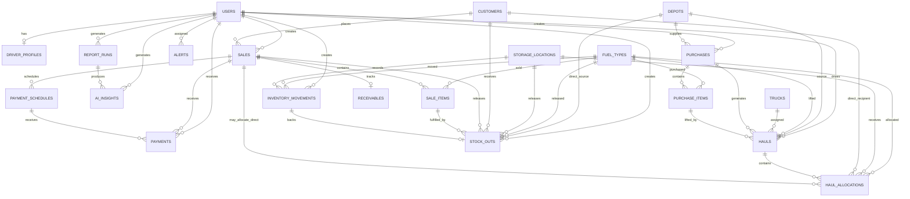

# CJP Southern Star OPC Database ERD

This document reflects the current Laravel schema after the delivery workflow removal migration. The current system does **not** use a `deliveries` table. Customer fulfillment is represented by `stock_outs`, either from garage inventory or directly from a completed depot/customer haul allocation.

## Current Workflow Summary

Supported operational flows:

1. Depot -> Purchase -> Purchase Item -> Haul -> Garage Allocation -> Stock-In Inventory Movement -> Sale -> Garage Stock-Out -> Stock-Out Inventory Movement -> Payment -> Receivable
2. Depot -> Purchase -> Purchase Item -> Haul -> Direct Customer Allocation -> Sale -> Depot Stock-Out -> Payment -> Receivable

Split hauls are supported through multiple `haul_allocations` rows for one haul. Allocation quantity is application-validated so active allocations cannot exceed the haul quantity.

## Current Business Tables

| Area | Tables |
| --- | --- |
| Users and access | `users`, `driver_profiles`, `sessions`, `password_reset_tokens` |
| Master data | `depots`, `fuel_types`, `storage_locations`, `customers`, `trucks` |
| Procurement | `purchases`, `purchase_items` |
| Fuel lifting | `hauls`, `haul_allocations` |
| Inventory | `inventory_movements`, `stock_outs` |
| Sales and finance | `sales`, `sale_items`, `payment_schedules`, `payments`, `receivables` |
| Monitoring and reports | `alerts`, `report_runs`, `ai_insights` |

## Relationship Overview



## Key Tables and Relationships

| Table | Purpose | Important relationships |
| --- | --- | --- |
| `users` | Authenticated accounts with role, status, and approval status | One user may create purchases/sales, receive payments, drive hauls, and create inventory records |
| `driver_profiles` | Driver-specific profile for driver-role users | `user_id -> users.id` |
| `depots` | Fuel source depots | Supplies purchases and hauls; can be direct stock-out source |
| `fuel_types` | Official fuel products | Related to purchase items, hauls, allocations, sale items, stock-outs, and movements |
| `storage_locations` | Garage tanks | Receives garage allocations and records inventory movements |
| `customers` | Customer/client records | Places sales and can receive direct allocations/stock-outs |
| `trucks` | Hauling or mixed trucks | Assigned to hauls |
| `purchases` | Procurement header | `depot_id`, `created_by` |
| `purchase_items` | Purchased fuel line item | `purchase_id`, `fuel_type_id` |
| `hauls` | Fuel lifting assignment | `purchase_id`, `purchase_item_id`, `depot_id`, `fuel_type_id`, `truck_id`, `driver_user_id` |
| `haul_allocations` | Destination split for a haul | Garage allocation uses `storage_location_id`; customer allocation uses `customer_id` and optional `sale_id` |
| `inventory_movements` | Garage inventory ledger | Stock-in references `haul_allocation`; stock-out references `stock_out` |
| `stock_outs` | Customer fulfillment/release record | Garage stock-out has `storage_location_id`; direct depot stock-out has `depot_id` and `haul_allocation_id` |
| `sales` | Financial sale header | `customer_id`, `created_by` |
| `sale_items` | Sold fuel line item | Fulfilled by one or more stock-outs |
| `payment_schedules` | Optional installment plan | Related to sale and payments |
| `payments` | Cash/cheque/bank/advance payment records | Related to sale, optional schedule, and receiving user |
| `receivables` | One-to-one receivable status for a sale | Amount is derived from sale items minus payments |
| `alerts` | Operational alerts | Optional assigned user and polymorphic reference |
| `report_runs` | Generated report metadata | Related to generating user |
| `ai_insights` | AI report/insight output | Optional report run and generating user |

## Stock-Out Fulfillment Rules

Garage stock-out:

- `stock_outs.source_type = garage`
- `storage_location_id` is required for a released garage stock-out
- A released garage stock-out must have exactly one backing `inventory_movements` row with:
  - `reference_type = stock_out`
  - `reference_id = stock_outs.id`
  - `direction = out`
  - `movement_type = stock_out`

Direct depot stock-out:

- `stock_outs.source_type = depot`
- `haul_allocation_id` is required
- `depot_id` identifies the source depot
- No garage inventory movement is created
- The linked haul allocation must be customer-bound, completed, and tied to the same sale/customer/fuel

Prepared stock-out:

- When a sale is created but garage stock is insufficient, the system can create a `prepared` stock-out without a `storage_location_id` or `inventory_movement_id`.
- A later valid garage or depot release converts or reduces the prepared record.

## Financial Rules

- Sale line totals are server-calculated from quantity and unit price.
- Receivable amount is derived, not stored:

```text
SUM(sale_items.line_total) - SUM(payments.amount)
```

- Payments cannot exceed sale balance.
- Installment payments cannot exceed the selected payment schedule balance.
- Receivable status is updated from payment totals.

## Current Schema Risks

| Risk | Current mitigation | Remaining concern |
| --- | --- | --- |
| Conditional fields on `haul_allocations` | Controller validation and status-transition checks | Database check constraints are not used |
| Conditional fields on `stock_outs` | Controller/service validation | Database check constraints are not used |
| Polymorphic references on alerts and inventory movements | Application validation and reporting filters | Orphaned references are possible if bypassing app code |
| Driver role validity for hauls | App validates active driver users | Database cannot enforce `users.role = driver` |
| Prepared stock-outs | Application conversion/reduction logic | Requires careful reporting filters |
| Business code generation | Unique database constraints and randomized smoke-test codes | Some legacy max-id code generation remains in controllers/services |

## Notes for Turnover

- The current schema intentionally has no active `deliveries` table.
- Do not use older delivery-based diagrams for training or acceptance testing.
- Turnover workflow testing should use stock-in, stock-out, and inventory movements as the operational fulfillment records.
